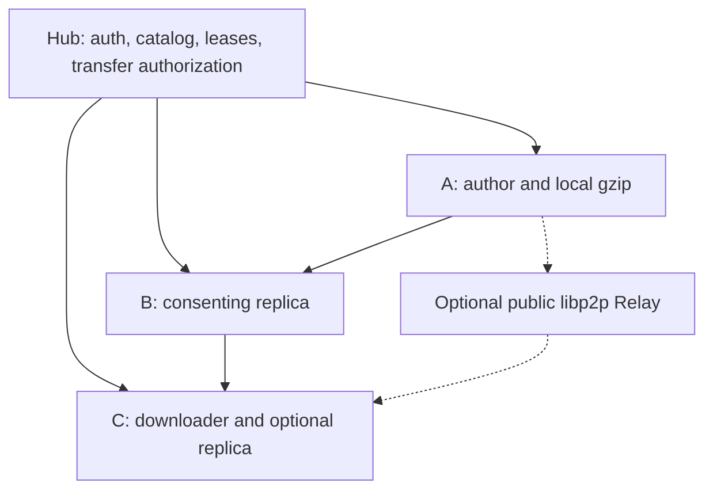

# Battle Viewer / Battle Hub P2P implementation plan

Status: Phase 0 contract and executable content experiment, 2026-10-08.
Production P2P networking is **not implemented** by this document or the spike.
The current source code takes precedence over old design documents.

## Source baseline

| Repository | develop SHA | Latest merged work | Open PRs at investigation |
|---|---|---|---|
| tanku3080/battle-viewer | 58f475895bab2884f0218ccd757b13dd1a8b0fe7 | #43 Creator interpolation preservation | none |
| tanku3080/battle-hub | c37093f180cb5ec2d29b158d49efe77cdc01ceac | #6 desktop authentication/version | none |

FE uses Next.js 16.3.8, React 19, TypeScript, Tauri 2.12.1, Rust edition 2024/MSRV 1.90.
BE uses Java 21 and Spring Boot 3.5.7. Authentication, refresh tokens, forces and
legacy uploaded JSON currently use process memory. There is one configured account;
there is no existing multi-account registration or license entitlement service.
`/api/battles` stores the full document and returns it. `/hub` only lists summaries.
Rust `src-tauri/src/lib.rs` provides authenticated Hub HTTP commands but no peer service.

Creator generates `creatorState.version = 2`, including hierarchy identity, group
toggle history, explicit movement points and camera interpolation. Viewer parsing
builds derived indexes and intentionally ignores creatorState. **Never publish a
re-serialized BattleData projection**: it would discard editing information.

## Responsibilities

Hub will hold metadata and time-limited provider records. It will not proxy or
persist new P2P payloads. Peers store verified gzip content only after consent.
Catalog visibility and availability are separate: zero live leases means
`NO_ONLINE_PEERS`, not an HTTP download fallback. A recorded lease is an untrusted
reachability hint, not proof that a file was successfully transferred.

## Phase boundaries / PR policy

| Phase | Independently reviewable delivery | Gate |
|---|---|---|
| 0 | Source audit, content manifest, gzip/hash/Creator preservation experiment | existing FE tests + adversarial content tests |
| 1 | authenticated metadata-only v2 API, persistence, pagination/search, owner/moderator stop | BE API, reopen, H2 and real PostgreSQL tests |
| 2a | Rust bounded gzip/hash/JSON validation crate + quota cache | native unit tests, corruption/bomb/path tests |
| 2b | Tauri commands, persistent settings, identity, explicit participation/privacy UI | Windows/Linux builds + i18n/accessibility |
| 3a | libp2p direct encrypted request/response, local multi-peer test | A to B to C transfer + interrupted-source retry |
| 3b | Hub leases/discovery, peer-bound authorization, optional Relay/DCUtR | revoked/expired grants rejected + real NAT trial |
| 4 | consent-only replica scheduling, 3-replica goal, lease expiry, bounded backoff, quotas | source-offline and all-offline tests |
| 5 | new Hub catalog/detail UI, publish/download, Viewer and Creator raw-byte handoff | both import paths preserve v2 editing state |
| 6 | end-to-end fixtures, security review, current-source design document, runbook | explicit final acceptance matrix |

Every feature branch starts at the latest develop. Never auto-merge. A later
branch needing an unmerged PR must cherry-pick only its necessary commits and
name that PR dependency; do not quietly pretend it is in develop. Keep PRs
limited to one phase or smaller feature, with SHA, tests and restart instructions.
Phase 0/1 are a useful stopping point because they can be reviewed without enabling
any unauthenticated peer listener. The full P2P acceptance criteria remain open.

## Content protocol v1

Machine-readable constants: `p2p/protocol-v1.json`; checked manifest:
`utils/p2p/manifest.ts`. `scripts/p2p-content-spike.mjs` is a Node **experiment**,
not the production Tauri path. Its bounded decoder verifies envelope integrity,
UTF-8 and JSON object syntax; production semantic validation belongs in Phase 2.

1. Preserve the complete original UTF-8 JSON bytes (Creator output or local file).
2. Compute lowercase SHA-256 `contentHash` over those uncompressed bytes.
3. Gzip once, store that exact gzip on the author, and compute `compressedHash`.
4. Register only metadata plus both hashes, exact sizes, encoding `gzip` and
   protocolVersion `1`. Replicas copy the same gzip bytes instead of recompressing.
5. Check manifest limits before reading; cap compressed stream at 8 MiB. Verify
   exact compressed size/hash before inflation. Inflate into a bounded stream,
   at most the declared raw size and at most 32 MiB. Check raw size/hash, UTF-8,
   strict JSON syntax and Battle schema before promoting an atomic cache file.
6. Pass the raw document to the existing Viewer loader or Creator importer.
   Do not reconstruct or rewrite creatorState. Local save/read remains available.

Separate compressed and raw hashes avoid assuming that every gzip encoder creates
identical bytes. The limits include embedded images; a large local battle may
still be saved/loaded locally but cannot be shared until it meets the share limit.
Metadata-only registration cannot prove schema validity: claims stay unverified
until a peer validates actual bytes. Never present registration as a completed upload.

## Database and backward compatibility

Phase 1 adds `/api/v2/works`. Existing `/api/battles`, force and authentication
contracts stay intact for a staged migration. The legacy central upload remains
until Phase 5 switches P2P publication and its removal has an explicit migration.
Existing memory-only uploads cannot survive a restart and are not silently copied
into a new database. P2P data uses a separate Flyway-managed schema.

Default: embedded H2 file database in the same Hub process (`./data/battle-hub`).
It adds no external service and requires a persistent writable volume; an ephemeral
free host does not make it durable. PostgreSQL is supported by an explicit profile
and the same migrations. CI must exercise actual PostgreSQL, not just H2 compatibility
mode. Migrating H2 rows to PostgreSQL needs an export/import procedure, not just
switching the URL. Backup the H2 database while stopped or use its backup tooling;
use pg_dump/pg_restore for PostgreSQL. Auth/force durability is outside Phase 1.

## Transport selection and NAT scope

Candidate: actively maintained rust-libp2p, initially evaluate the 0.56 documented
API before choosing/pinning a tested version in Cargo.lock. Use TCP + Noise +
Yamux first, `request-response` with explicitly bounded codecs, Identify + Ping,
optional QUIC after parity tests. Hub discovery replaces a dedicated bootstrap
network for the first release. mDNS is opt-in LAN discovery only; avoid public DHT
announcements that make catalog access controls or IP privacy harder to enforce.

Direct LAN/public-address connections can be tested locally. NAT discovery and
DCUtR hole punching use Circuit Relay v2; symmetric NAT/CGNAT/firewall cases may
still require actual relayed traffic. No Relay is deployed or enabled by default.
Do not depend on an unknown public Relay or advertise universal NAT traversal.
Relay reservations, concurrent streams and byte budgets must be bounded. If no
direct or authorized relay route exists, display `UNREACHABLE`; if all leases are
expired, display `NO_ONLINE_PEERS`. A real multi-network trial is still required.

Primary technical references (reviewed 2026-10-08):

- https://libp2p.github.io/rust-libp2p/libp2p/tutorials/hole_punching/index.html
- https://libp2p.io/connectivity/
- https://h2database.github.io/html/features.html
- https://www.postgresql.org/docs/current/app-pgdump.html

## Authorization, abuse and privacy requirements

- Existing bearer/refresh handling remains authoritative. Derive author/owner from
  the authenticated session; a request-supplied display name is not authorization.
- Each transfer carries work ID, hash, requester PeerId and provider PeerId. The
  provider checks the encrypted connection identity and obtains a fresh Hub decision
  before sending data. Hub unavailable means authorization fails closed. Do not
  expose a hash-only anonymous endpoint or embed bearer tokens in peer discovery.
- Initial implementation can use an opaque short-lived one-use grant redeemed over
  Hub HTTPS. Do not hand-roll signatures or send license/session secrets between peers.
  Grant redemption must check active work and current account/entitlement policy.
- Author/moderator stop is persisted. Providers check before **each** new transfer,
  stop advertising revoked works and eventually remove cached replicas. A downloaded
  local file cannot be remotely erased; document that limit. A stopped catalog record
  must never remain downloadable because of a stale lease/grant.
- Participation defaults OFF. Consent text must cover disk, upload bandwidth and
  disclosure of network addresses to other connected participants. Downloading is
  distinct from agreeing to redistribute. Turning OFF withdraws leases and listener
  service immediately; cached data is removable independently.
- Discovery is authenticated and addresses are shared only with authorized requesters,
  never in the public catalog. Direct P2P inherently exposes endpoint addresses;
  a Relay is not a promise of anonymity. Avoid logging IPs or tokens. No extra IP lookup
  services, telemetry, ads or billing are part of this work.
- Bound metadata requests (16 KiB), strings, page sizes, lease/address counts, sockets,
  inflight bytes, timeouts, backoff and upload rate. JSON schemas must reject nonfinite
  coordinates, invalid links/IDs/times, unsafe image URLs and resource-exhaustion input.
  Do not fetch arbitrary metadata URLs on Hub (SSRF). Store hashes as filenames;
  never trust remote paths. Atomic writes + validation precede cache visibility.

## Replication policy and UI differences

Target is three distinct consenting installations, not three connections or three
claims on one identity. Leases expire after 90 seconds; heartbeat starts only after
validated durable storage. Phase 4 must distinguish claimed copies, live providers
and successful transfers, remove dead hints, and select alternate healthy peers.
An authenticated attacker can generate identities, so three PeerIds alone are not
proof of three independent physical machines; label the count accurately.

Default storage budget is 256 MiB and default upload budget 256 KiB/s. Both are
editable and hard enforced; pinned author files must never be silently evicted.
Insufficient space reduces replication and shows that status. Do not enable unlimited
re-replication loops or let toggled-off clients participate through a background path.

Tauri performs disk/network work in Rust. Web initially supports authenticated metadata
browsing and explains that P2P download/sharing needs the installed application, with
local file import kept intact. No central body download or fake Web P2P button. All
new product UI uses ja/en locale keys, keyboard focus, associated labels and live status.

## Operating cost (no services purchased)

| Component | Zero new monthly service fee option | What is not guaranteed |
|---|---|---|
| Hub + H2 | existing/self-hosted process and persistent disk | free hosting, uptime, disk backup or always-on hardware |
| PostgreSQL | same owner-managed machine | hosted provider's free quota/retention; no provider chosen |
| Peer payloads | consenting user PCs and their connectivity | online availability, bandwidth or user's electricity cost |
| Discovery/bootstrap | existing authenticated Hub | Hub uptime; no dedicated bootstrap purchased |
| NAT Relay | disabled, direct peers only initially | NAT success; always-on relay and transit bandwidth may cost money |

No numeric paid quote is invented without a region/provider/load. If trials show a
Relay is necessary, first measure connections and bytes, then present the user's
chosen provider's current pricing before any contract. Meta DB and Relay bills must
be evaluated separately. 0 yen infrastructure is a deployment constraint, not an SLA.

## Outstanding acceptance matrix

| Operation | Phase 0 outcome | Required later |
|---|---|---|
| A publishes; catalog reflects work | not implemented | 1 + 5 |
| B downloads and plays | raw sample codec/import parity only | 2 + 3 + 5 |
| A offline; B serves C | not tested | 3 + 4 multi-process test |
| consenting replication to 3 peers | not implemented | 4 |
| all peers offline status | contract only | 3 + 4 + 5 |
| gzip, size and SHA validation | executable experiment, tests | native Rust production validation |
| Creator editing information retained | byte-preserving experiment + current importer | 2 + 5 integration |
| real NAT / Windows runtime | unverified | native builds + external multi-network trial |

Update `docs/P2P_HANDOFF.md` after every PR with exact remote SHA, URL, checks,
limitations and next edits. Do not declare the whole platform complete at this checkpoint.
